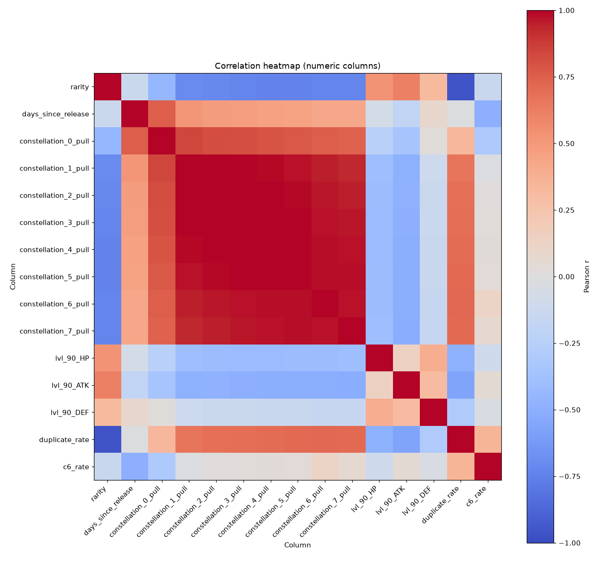
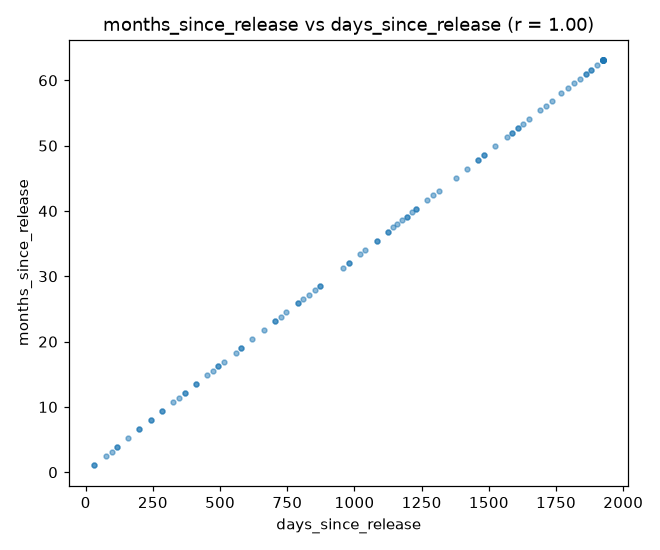
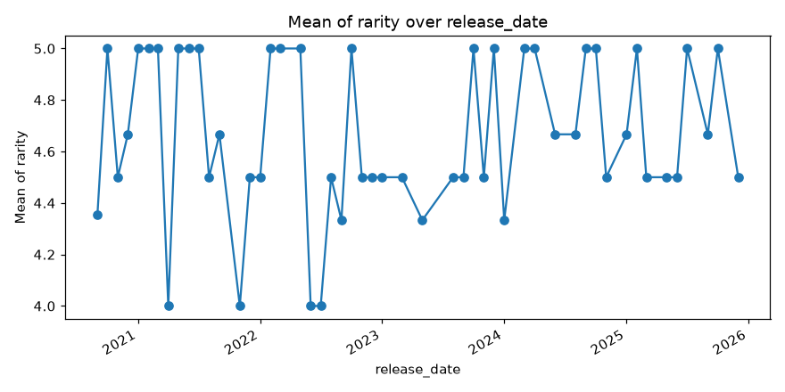
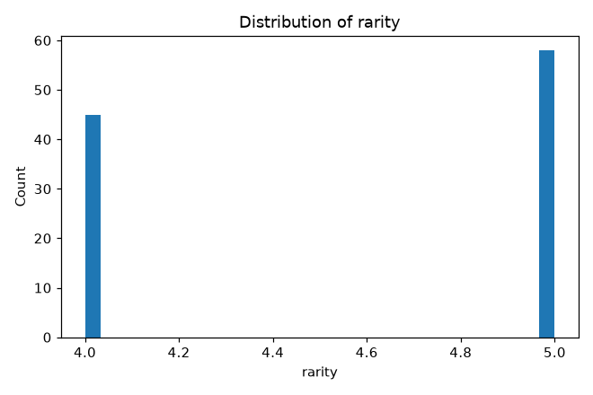
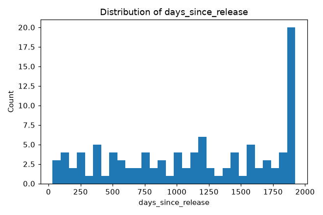
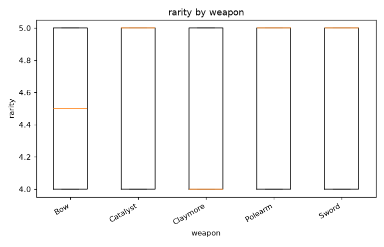
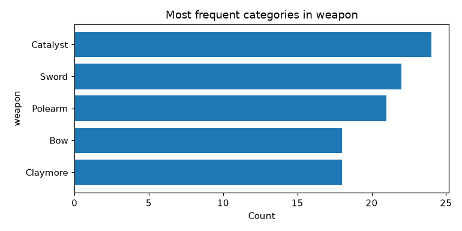
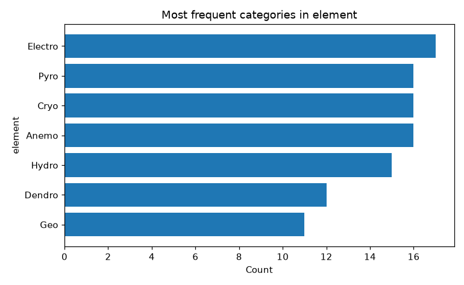

# Profile: genshin_impact.csv

## 1. Dataset overview

- **Filename:** genshin_impact.csv
- **Rows:** 103
- **Columns:** 32
- **Column names:** Unnamed: 0, name, rarity, weapon, element, 3D-model, region, release_date, days_since_release, banner_versions, banner_dates, roles, constellation_0_pull, constellation_1_pull, constellation_2_pull, constellation_3_pull, constellation_4_pull, constellation_5_pull, constellation_6_pull, constellation_7_pull, asc_stat_bonus_category, lvl_90_HP, lvl_90_ATK, lvl_90_DEF, duplicate_rate, c6_rate, avg_copies_per_player, num_banners, months_since_release, is_standard_banner, is_archon, pulled_count

| Column | Inferred type | Probable role | Non-missing | Missing % | Unique values |
|---|---|---|---|---|---|
| Unnamed: 0 | int64 | Identifier-like field | 103 | 0.00% | 103 |
| name | string | Identifier-like field | 103 | 0.00% | 103 |
| rarity | int64 | Numeric measure | 103 | 0.00% | 2 |
| weapon | string | Categorical attribute | 103 | 0.00% | 5 |
| element | string | Categorical attribute | 103 | 0.00% | 7 |
| 3D-model | string | Categorical attribute | 103 | 0.00% | 5 |
| region | string | Categorical attribute | 103 | 0.00% | 9 |
| release_date | datetime | Date-like field | 103 | 0.00% | 64 |
| days_since_release | int64 | Numeric measure | 103 | 0.00% | 64 |
| banner_versions | string | Categorical attribute | 103 | 0.00% | 96 |
| banner_dates | string | Free-text field | 103 | 0.00% | 97 |
| roles | string | Categorical attribute | 103 | 0.00% | 12 |
| constellation_0_pull | int64 | Numeric measure | 103 | 0.00% | 103 |
| constellation_1_pull | int64 | Numeric measure | 103 | 0.00% | 103 |
| constellation_2_pull | int64 | Numeric measure | 103 | 0.00% | 103 |
| constellation_3_pull | int64 | Numeric measure | 103 | 0.00% | 103 |
| constellation_4_pull | int64 | Numeric measure | 103 | 0.00% | 96 |
| constellation_5_pull | int64 | Numeric measure | 103 | 0.00% | 97 |
| constellation_6_pull | int64 | Numeric measure | 103 | 0.00% | 101 |
| constellation_7_pull | int64 | Numeric measure | 103 | 0.00% | 98 |
| asc_stat_bonus_category | string | Categorical attribute | 103 | 0.00% | 16 |
| lvl_90_HP | int64 | Numeric measure | 103 | 0.00% | 66 |
| lvl_90_ATK | int64 | Numeric measure | 103 | 0.00% | 60 |
| lvl_90_DEF | int64 | Numeric measure | 103 | 0.00% | 66 |
| duplicate_rate | float64 | Numeric measure | 103 | 0.00% | 103 |
| c6_rate | float64 | Numeric measure | 103 | 0.00% | 103 |
| avg_copies_per_player | float64 | Numeric measure | 103 | 0.00% | 103 |
| num_banners | int64 | Numeric measure | 103 | 0.00% | 15 |
| months_since_release | float64 | Numeric measure | 103 | 0.00% | 64 |
| is_standard_banner | boolean | Boolean field | 103 | 0.00% | 2 |
| is_archon | boolean | Boolean field | 103 | 0.00% | 2 |
| pulled_count | int64 | Numeric measure | 103 | 0.00% | 103 |

*Types and roles are heuristics based on the values. The program does not guess what any column name or abbreviation means, and cannot know units or valid ranges. Blank values and tokens like NA, null, ? count as missing; the file itself is not changed.*

## 2. Data quality

Checks run: duplicate rows, single-value columns, missingness above 30%, mixed types, identifier-like or high-cardinality columns, possibly sensitive fields. Nothing was removed or altered.

| Check | Column | Detail |
|---|---|---|
| identifier-like | Unnamed: 0 | 103 unique values; excluded from correlations |
| identifier-like | name | 103 unique values; excluded from correlations |
| high cardinality | banner_versions | 96 distinct categories |
| possibly sensitive | duplicate_rate | values resemble phone-style numbers |

*Sensitive-field detection only looks at column names and simple value patterns. No warning does not mean the dataset is free of sensitive data.*

## 3. Numeric columns

| Column | Valid | Missing | Min | Max | Mean | Median | Mode | Std | Q1 | Q3 | IQR | Outliers (1.5×IQR) |
|---|---|---|---|---|---|---|---|---|---|---|---|---|
| rarity | 103 | 0 (0.0%) | 4 | 5 | 4.5631 | 5 | 5 | 0.4984 | 4 | 5 | 1 | 0 (0.0%) |
| days_since_release | 103 | 0 (0.0%) | 32 | 1,924 | 1,136.9709 | 1,178 | 1,924 | 622.3255 | 578 | 1,751.5 | 1,173.5 | 0 (0.0%) |
| constellation_0_pull | 103 | 0 (0.0%) | 15,318 | 1,775,083 | 533,782.466 | 318,448 | none | 492,771.3842 | 159,055 | 788,685.5 | 629,630.5 | 1 (0.97%) |
| constellation_1_pull | 103 | 0 (0.0%) | 866 | 1,581,770 | 294,590.2718 | 69,352 | none | 418,771.2805 | 22,159 | 446,541 | 424,382 | 9 (8.74%) |
| constellation_2_pull | 103 | 0 (0.0%) | 252 | 1,213,152 | 221,787.5243 | 30,198 | none | 325,604.4577 | 7,525.5 | 325,993.5 | 318,468 | 10 (9.71%) |
| constellation_3_pull | 103 | 0 (0.0%) | 68 | 839,452 | 147,776.8932 | 9,124 | none | 223,934.6981 | 1,854 | 229,594 | 227,740 | 10 (9.71%) |
| constellation_4_pull | 103 | 0 (0.0%) | 35 | 562,730 | 96,946.2621 | 4,105 | 65 | 147,372.2608 | 772.5 | 157,910 | 157,137.5 | 7 (6.8%) |
| constellation_5_pull | 103 | 0 (0.0%) | 12 | 382,812 | 64,379.6505 | 3,780 | none | 96,980.6023 | 573 | 109,344 | 108,771 | 6 (5.83%) |
| constellation_6_pull | 103 | 0 (0.0%) | 21 | 261,968 | 50,187.2136 | 16,373 | 21, 3,913 | 65,212.4654 | 4,970 | 84,416.5 | 79,446.5 | 5 (4.85%) |
| constellation_7_pull | 103 | 0 (0.0%) | 8 | 1,042,197 | 152,643.0097 | 587 | none | 237,282.0215 | 154.5 | 235,137.5 | 234,983 | 7 (6.8%) |
| lvl_90_HP | 103 | 0 (0.0%) | 9,189 | 15,675 | 11,905.0777 | 12,289 | 13,348 | 1,621.5641 | 10,470 | 12,968.5 | 2,498.5 | 0 (0.0%) |
| lvl_90_ATK | 103 | 0 (0.0%) | 106 | 359 | 259.7864 | 244 | 212, 223, 244 | 60.5821 | 213.5 | 320.5 | 107 | 0 (0.0%) |
| lvl_90_DEF | 103 | 0 (0.0%) | 500 | 959 | 704.7573 | 712 | 751 | 103.4497 | 615 | 784 | 169 | 0 (0.0%) |
| duplicate_rate | 103 | 0 (0.0%) | 0.0369 | 0.8745 | 0.4421 | 0.3384 | none | 0.2829 | 0.193 | 0.7445 | 0.5514 | 0 (0.0%) |
| c6_rate | 103 | 0 (0.0%) | 0 | 0.1379 | 0.0338 | 0.033 | none | 0.0209 | 0.0237 | 0.0422 | 0.0184 | 5 (4.85%) |
| avg_copies_per_player | 103 | 0 (0.0%) | 1.0383 | 7.9703 | 2.5425 | 1.5114 | none | 1.6122 | 1.2393 | 3.9132 | 2.6739 | 1 (0.97%) |
| num_banners | 103 | 0 (0.0%) | 1 | 16 | 4.835 | 4 | 2 | 3.4869 | 2 | 6 | 4 | 4 (3.88%) |
| months_since_release | 103 | 0 (0.0%) | 1.0492 | 63.082 | 37.2777 | 38.623 | 63.082 | 20.4041 | 18.9508 | 57.4262 | 38.4754 | 0 (0.0%) |
| pulled_count | 103 | 0 (0.0%) | 16,854 | 7,659,164 | 1,562,093.165 | 652,085 | none | 1,921,421.9542 | 224,798 | 2,261,590.5 | 2,036,792.5 | 9 (8.74%) |

*Outliers are flagged, not removed. Mode is shown only when a value repeats and there are at most 3 tied.*

## 4. Categorical columns

**weapon**: 5 unique; most frequent: Catalyst

| Value | Count | % of non-missing |
|---|---|---|
| Catalyst | 24 | 23.3% |
| Sword | 22 | 21.36% |
| Polearm | 21 | 20.39% |
| Claymore | 18 | 17.48% |
| Bow | 18 | 17.48% |

**element**: 7 unique; most frequent: Electro

| Value | Count | % of non-missing |
|---|---|---|
| Electro | 17 | 16.5% |
| Anemo | 16 | 15.53% |
| Cryo | 16 | 15.53% |
| Pyro | 16 | 15.53% |
| Hydro | 15 | 14.56% |
| Dendro | 12 | 11.65% |
| Geo | 11 | 10.68% |

**3D-model**: 5 unique; most frequent: Medium Female

| Value | Count | % of non-missing |
|---|---|---|
| Medium Female | 36 | 34.95% |
| Medium Male | 21 | 20.39% |
| Tall Female | 21 | 20.39% |
| Tall Male | 14 | 13.59% |
| Short Female | 11 | 10.68% |

**region**: 9 unique; most frequent: Liyue

| Value | Count | % of non-missing |
|---|---|---|
| Liyue | 21 | 20.39% |
| Mondstadt | 18 | 17.48% |
| Inazuma | 17 | 16.5% |
| Sumeru | 14 | 13.59% |
| Fontaine | 13 | 12.62% |
| Natlan | 11 | 10.68% |
| Nod-Krai | 6 | 5.83% |
| Snezhnaya | 2 | 1.94% |
| Extra-Terresterial | 1 | 0.97% |

**banner_versions**: 96 unique; most frequent: ['4.5'], ['Luna I']

| Value | Count | % of non-missing |
|---|---|---|
| ['4.5'] | 3 | 2.91% |
| ['Luna I'] | 3 | 2.91% |
| ['2.1', '2.5', '3.3', '4.3', '5.0', '5.6'] | 2 | 1.94% |
| ['5.7'] | 2 | 1.94% |
| ['Luna III'] | 2 | 1.94% |
| ['4.0', '4.6', '5.6'] | 1 | 0.97% |
| ['5.5', 'Luna III'] | 1 | 0.97% |
| ['1.1', '1.3', '2.0', '2.2', '2.4', '2.7', '3.7', '4.1', '5.4', '5.3'] | 1 | 0.97% |
| ['3.0', 'Luna I'] | 1 | 0.97% |
| ['1.3', '5.3'] | 1 | 0.97% |

**roles**: 12 unique; most frequent: On-Field,DPS

| Value | Count | % of non-missing |
|---|---|---|
| On-Field,DPS | 37 | 35.92% |
| Off-Field,Survivability | 14 | 13.59% |
| Off-Field,DPS | 13 | 12.62% |
| Off-Field,Support,Survivability | 12 | 11.65% |
| Off-Field,Support | 10 | 9.71% |
| Off-Field,DPS,Support | 5 | 4.85% |
| Off-Field,DPS,Survivability | 5 | 4.85% |
| On-Field,DPS,Survivability | 2 | 1.94% |
| Off-Field,DPS,Support,Survivability | 2 | 1.94% |
| On-Field,Support,Survivability | 1 | 0.97% |

**asc_stat_bonus_category**: 16 unique; most frequent: CRIT DMG

| Value | Count | % of non-missing |
|---|---|---|
| CRIT DMG | 18 | 17.48% |
| ATK% | 17 | 16.5% |
| CRIT Rate | 16 | 15.53% |
| HP% | 14 | 13.59% |
| Elemental Mastery | 11 | 10.68% |
| Geo DMG Bonus | 5 | 4.85% |
| Energy Recharge | 5 | 4.85% |
| Anemo DMG Bonus | 3 | 2.91% |
| Healing Bonus | 3 | 2.91% |
| Dendro DMG Bonus | 2 | 1.94% |

**is_standard_banner**: 2 unique; most frequent: 1

| Value | Count | % of non-missing |
|---|---|---|
| 1 | 53 | 51.46% |
| 0 | 50 | 48.54% |

**is_archon**: 2 unique; most frequent: 0

| Value | Count | % of non-missing |
|---|---|---|
| 0 | 97 | 94.17% |
| 1 | 6 | 5.83% |

## 5. Relationships

Pearson correlation, identifier-like columns excluded. Correlation is not causation. Full matrix in `correlation_matrix.csv`.

**Strongest positive:**

| Column A | Column B | r | Rows used |
|---|---|---|---|
| days_since_release | months_since_release | 1.0 | 103 |
| constellation_2_pull | constellation_3_pull | 0.998 | 103 |
| constellation_3_pull | constellation_4_pull | 0.998 | 103 |

**Strongest negative:**

| Column A | Column B | r | Rows used |
|---|---|---|---|
| rarity | duplicate_rate | -0.956 | 103 |
| rarity | avg_copies_per_player | -0.894 | 103 |
| rarity | constellation_5_pull | -0.739 | 103 |

## 6. Visualizations

**Skipped plot types:**

- missing-value bar chart: no missing values

## 7. AI-assisted insights

AI-generated narrative insights were skipped because the model was unavailable or its reply was unusable (timed out).