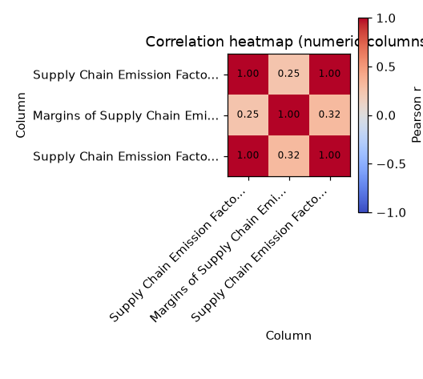
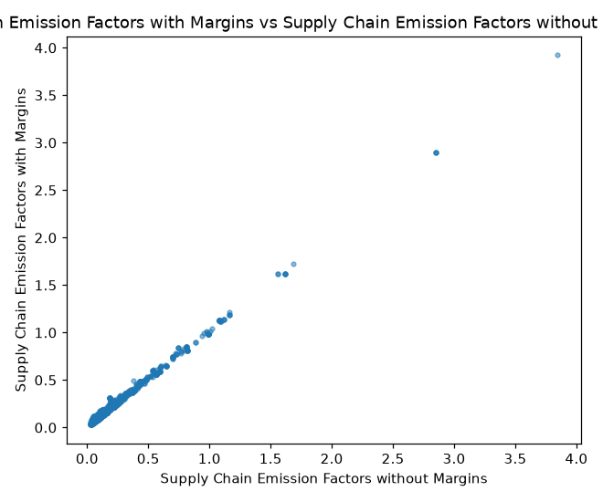
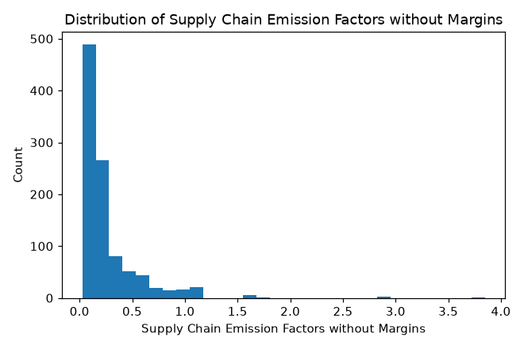
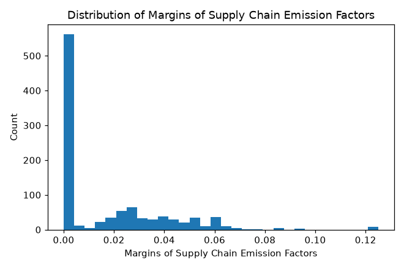

# Profile: SupplyChainGHGEmissionFactors_2022.csv

## 1. Dataset overview

- **Filename:** SupplyChainGHGEmissionFactors_2022.csv
- **Rows:** 1,016
- **Columns:** 8
- **Column names:** 2017 NAICS Code, 2017 NAICS Title, GHG, Unit, Supply Chain Emission Factors without Margins, Margins of Supply Chain Emission Factors, Supply Chain Emission Factors with Margins, Reference USEEIO Code

| Column | Inferred type | Probable role | Non-missing | Missing % | Unique values |
|---|---|---|---|---|---|
| 2017 NAICS Code | int64 | Identifier-like field | 1,016 | 0.00% | 1,016 |
| 2017 NAICS Title | string | Identifier-like field | 1,016 | 0.00% | 1,016 |
| GHG | string | Categorical attribute | 1,016 | 0.00% | 1 |
| Unit | string | Categorical attribute | 1,016 | 0.00% | 1 |
| Supply Chain Emission Factors without Margins | float64 | Numeric measure | 1,016 | 0.00% | 274 |
| Margins of Supply Chain Emission Factors | float64 | Numeric measure | 1,016 | 0.00% | 69 |
| Supply Chain Emission Factors with Margins | float64 | Numeric measure | 1,016 | 0.00% | 281 |
| Reference USEEIO Code | mixed (numeric + text) | Unknown or mixed type | 1,016 | 0.00% | 386 |

*Types and roles are heuristics based on the values. The program does not guess what any column name or abbreviation means, and cannot know units or valid ranges. Blank values and tokens like NA, null, ? count as missing; the file itself is not changed.*

## 2. Data quality

Checks run: duplicate rows, single-value columns, missingness above 30%, mixed types, identifier-like or high-cardinality columns, possibly sensitive fields. Nothing was removed or altered.

| Check | Column | Detail |
|---|---|---|
| identifier-like | 2017 NAICS Code | 1,016 unique values; excluded from correlations |
| identifier-like | 2017 NAICS Title | 1,016 unique values; excluded from correlations |
| single value | GHG | only one distinct value across 1,016 non-missing rows |
| single value | Unit | only one distinct value across 1,016 non-missing rows |
| mixed types | Reference USEEIO Code | mixed (numeric + text); values could not be read as one type |

*Sensitive-field detection only looks at column names and simple value patterns. No warning does not mean the dataset is free of sensitive data.*

## 3. Numeric columns

| Column | Valid | Missing | Min | Max | Mean | Median | Mode | Std | Q1 | Q3 | IQR | Outliers (1.5×IQR) |
|---|---|---|---|---|---|---|---|---|---|---|---|---|
| Supply Chain Emission Factors without Margins | 1,016 | 0 (0.0%) | 0.026 | 3.846 | 0.265 | 0.159 | 0.111 | 0.3148 | 0.103 | 0.3023 | 0.1993 | 93 (9.15%) |
| Margins of Supply Chain Emission Factors | 1,016 | 0 (0.0%) | 0 | 0.125 | 0.0169 | 0 | 0 | 0.0234 | 0 | 0.0302 | 0.0302 | 17 (1.67%) |
| Supply Chain Emission Factors with Margins | 1,016 | 0 (0.0%) | 0.029 | 3.924 | 0.2819 | 0.173 | 0.111 | 0.3214 | 0.108 | 0.3293 | 0.2213 | 84 (8.27%) |

*Outliers are flagged, not removed. Mode is shown only when a value repeats and there are at most 3 tied.*

## 4. Categorical columns

**GHG**: 1 unique; most frequent: All GHGs

| Value | Count | % of non-missing |
|---|---|---|
| All GHGs | 1,016 | 100.0% |

**Unit**: 1 unique; most frequent: kg CO2e/2022 USD, purchaser price

| Value | Count | % of non-missing |
|---|---|---|
| kg CO2e/2022 USD, purchaser price | 1,016 | 100.0% |

## 5. Relationships

Pearson correlation, identifier-like columns excluded. Correlation is not causation. Full matrix in `correlation_matrix.csv`.

**Strongest positive:**

| Column A | Column B | r | Rows used |
|---|---|---|---|
| Supply Chain Emission Factors without Margins | Supply Chain Emission Factors with Margins | 0.998 | 1,016 |
| Margins of Supply Chain Emission Factors | Supply Chain Emission Factors with Margins | 0.317 | 1,016 |
| Supply Chain Emission Factors without Margins | Margins of Supply Chain Emission Factors | 0.25 | 1,016 |

**Strongest negative:** none

## 6. Visualizations

**Skipped plot types:**

- missing-value bar chart: no missing values
- time-series plot: no date-like column with at least 3 distinct dates spread over 3 or more periods
- numeric distribution by category (boxplot): needs a numeric column and a categorical column with 2 to 8 categories
- categorical frequency bar chart: no categorical column with at least 2 categories

## 7. AI-assisted insights

*Written by `qwen2.5:0.5b` from the verified summary in `analysis_summary.json`. The model did not compute anything.*

1. **distribution** [GHG]: The distribution of GHG values across the dataset is uniform, with 1,016 unique values.
2. **numeric columns** [Supply Chain Emission Factors without Margins]: The numeric column 'Supply Chain Emission Factors without Margins' contains 1,016 unique values, with a minimum of 0.026 kg CO2e/2022 USD, a maximum of 3.846 kg CO2e/2022 USD, a mean of 0.265 kg CO2e/2022 USD, a median of 0.159 kg CO2e/2022 USD, and an outlier count of 93.
3. **numeric columns** [Margins of Supply Chain Emission Factors]: The numeric column 'Margins of Supply Chain Emission Factors' contains 1,016 unique values, with a minimum of 0.0 kg CO2e/2022 USD, a maximum of 0.125 kg CO2e/2022 USD, a mean of 0.0169 kg CO2e/2022 USD, and an outlier count of 17.
4. **categorical columns** [GHG]: The categorical column 'GHG' contains 1 unique value: 'All GHGs'. It has a top value of 1016 unique values and a count of 1016.
5. **categorical columns** [Unit]: The categorical column 'Unit' contains 1 unique value: 'kg CO2e/2022 USD, purchaser price'. It has a count of 1016.
6. **relationship** [strongest_positive]: The relationship between 'Supply Chain Emission Factors without Margins' and 'Supply Chain Emission Factors with Margins' is strongest positive, with a Pearson correlation of 0.998.
7. **relationship** [strongest_negative]: The relationship between 'Margins of Supply Chain Emission Factors' and 'Supply Chain Emission Factors with Margins' is strongest negative, with a Pearson correlation of 0.317.
8. **limitation** [Relationships]: The analysis does not consider the relationship between 'Supply Chain Emission Factors without Margins' and 'Margins of Supply Chain Emission Factors'.